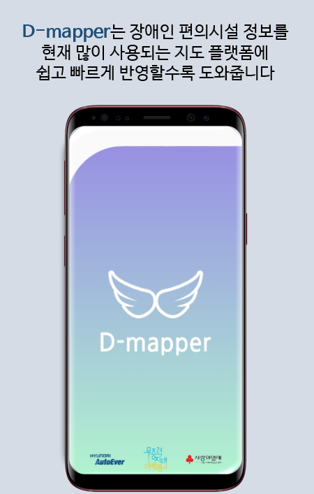
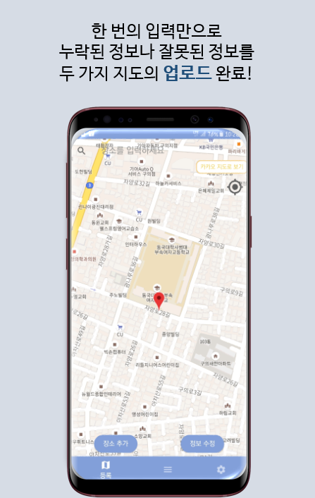
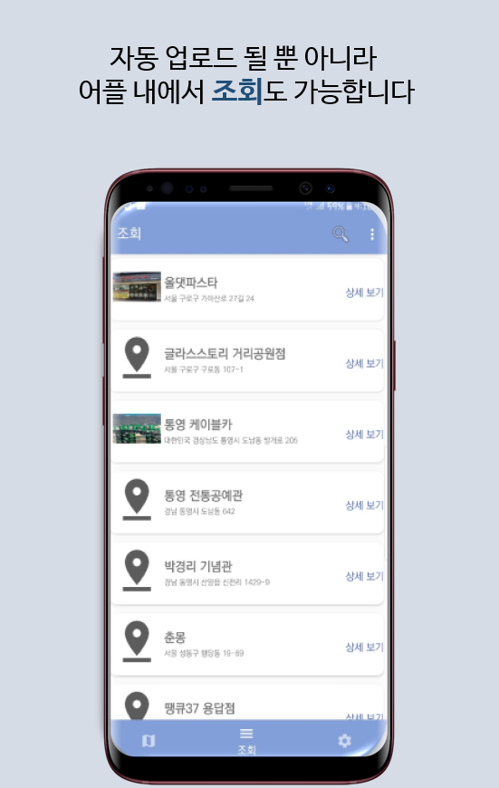
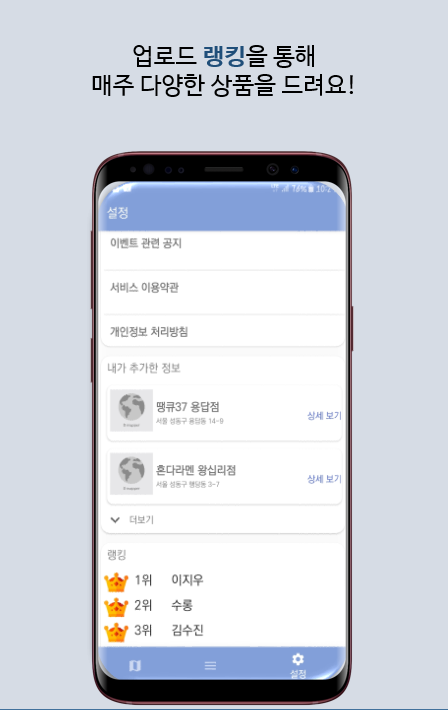

# dmapper-Android
2019 현대오토에버 배리어프리앱 공모전 - AndroidStudio 구현

## 프로젝트 개요 

## 소개 동영상

## 개발 환경

플레이스토어 - AndroidStudio로 구현 
 앱스토어 - ReactNative로 구현 

## Preview

  
  
  
  
  

## Collaboraters

나재원 (jw291)

